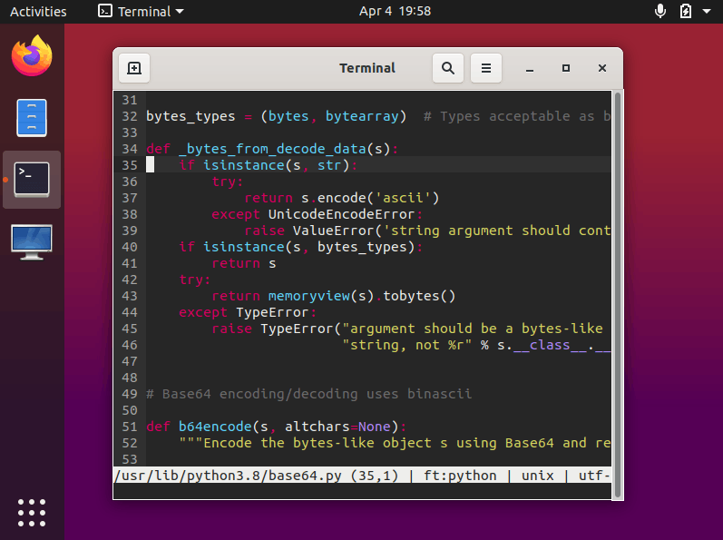

Ubuntu Desktop VM Appliance
===========================

This is a minimal VM appliance running Ubuntu Desktop with Git, Python 3, C/C++ build tools, and the [Micro](https://github.com/zyedidia/micro) text editor preinstalled.



Installation
------------

- Download the [VM appliance](https://github.com/jncraton/ubuntu-desktop-vm/releases/download/v1.7/ubuntu-desktop.ova) file from the [releases](https://github.com/jncraton/ubuntu-desktop-vm/releases/latest)
- Run it in your VM host of choice, such as [VirtualBox](https://www.virtualbox.org/) (Windows, MacOS, Linux) or [Virt-manager](https://virt-manager.org/) (Linux).

Password
--------

There is no password required to login, but the default password for `sudo` access is "password".

Sharing Files Between Host and Guest
------------------------------------

### Git

Git is provided to make it easy to interact with repositories located on external hosts. You can clone a repository from your host system over SSH (which you may need to install first) using a command such as:

```
git clone ssh://{user}@{host}:{port}/path/to/repository
```

It is typical for the host to be assigned the IP `10.0.2.2` and SSH will default to using port 22.

### SSH

SSH can be used to login to remote systems. Tools such as `scp` can be to copy files over SSH. 

If desired `sshfs` can be used to mount a path from the host system to the guest system.

Connecting via SSH from host to guest likely requires a port forward in your VM software. For example, after configuring a port forward from port 22222 on the host to port 22 on the guest, you can connect to the guest SSH server (which you'll need to install using `apt install openssh-server`) using:

`ssh -p 22222 localhost`
